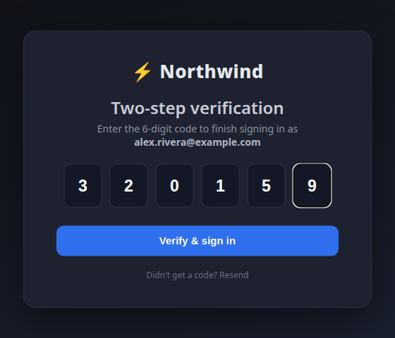
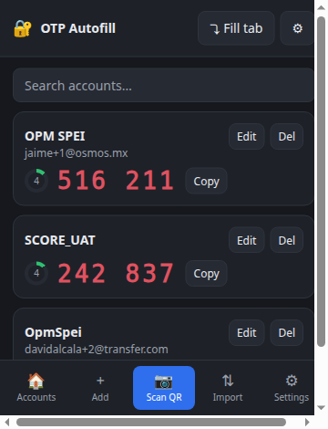
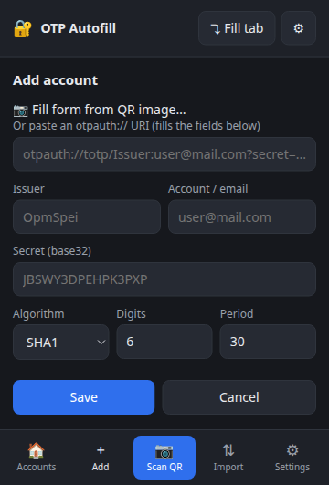
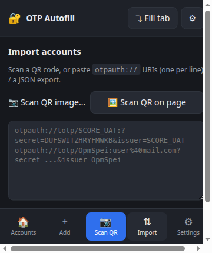
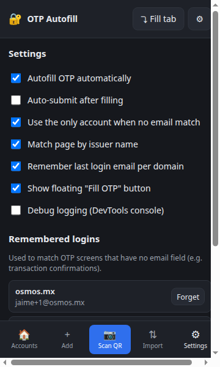

# 🔐 OTP Autofill Authenticator

A Chrome extension (Manifest V3) that **detects login + 2FA forms and autofills
your TOTP code automatically**. It understands two-step flows: it captures the
email you type on the login screen and uses it to pick the right account to fill
on the OTP screen — even in single-page apps where there's no full page reload
between steps, and even when the OTP screen has *no email field at all*.

No external services, no build step, no telemetry. Codes are computed locally
with the Web Crypto API; secrets never leave your machine — and never leave the
background service worker: web pages only ever receive a ready-made 6-digit
code, and only on sites you've approved. An optional master password encrypts
all seeds at rest (PBKDF2 + AES-256-GCM).

<p align="center">
  
</p>

---

## Table of contents

- [Features](#features)
- [Screenshots](#screenshots)
- [Install](#install)
- [Quick start](#quick-start)
- [Adding accounts](#adding-accounts)
- [How autofill works](#how-autofill-works)
- [Settings](#settings)
- [Import / export & overrides](#import--export--overrides)
- [Keyboard shortcut](#keyboard-shortcut)
- [Project layout](#project-layout)
- [Testing](#testing)
- [Troubleshooting](#troubleshooting)
- [Security & privacy](#security--privacy)
- [Limitations](#limitations)

---

## Features

- **Smart two-step detection** — captures the email/username on the login
  screen, then fills the matching account's code on the OTP screen.
- **Remembers the last login email per domain** — so OTP screens with **no
  email field** (e.g. a "Confirmar transacción" modal in an already-logged-in
  app) still autofill the right account.
- **Fills three OTP layouts**
  1. a single `one-time-code` field,
  2. a row of single-character boxes,
  3. the "one hidden `<input>` behind N decorative cells" pattern (e.g.
     transfercld's `.otp-block` divs + `input.hidden-input`).
- **Works through shadow DOM** and SPA screen swaps (deep input search + a
  periodic re-scan, since shadow-root mutations don't fire a light-DOM observer).
- **React/Vue-friendly filling** — sets values through the native setter, resets
  React's value tracker, and dispatches real `keydown`/`beforeinput`/`input`/
  `change` events so framework state updates.
- **Add accounts by QR** — pick a QR **image file**, **scan the QR on the current
  page** (and auto-fall back to the file picker if none is found), **right-click
  any QR image**, or **fill the Add form from a QR** for review before saving.
- **Search/filter** the account list by issuer or email.
- **Import / export** — paste `otpauth://` URIs or JSON; export to JSON / `.txt`.
- **Duplicate-aware import** — warns when an account already exists and lets you
  **override** it.
- **Live codes** in the popup with countdown rings and one-click copy.
- **Always-visible footer** with one-tap quick actions.
- Optional **auto-submit**, a floating "Fill OTP" helper button, and a debug log.
- **Master password (optional)** — encrypts all seeds at rest
  (PBKDF2-SHA256 600k + AES-256-GCM); unlocked once per browser session, with
  an optional inactivity auto-lock.
- **Per-site approval** — an account autofills silently only on domains where
  you've explicitly used it once (one click on the floating button binds the
  site); unknown pages can't silently harvest codes.
- **Encrypted backups** — export is passphrase-encrypted by default; plaintext
  export sits behind an explicit warning.
- **Clipboard hygiene** — copied codes are wiped from the clipboard after 45 s
  (only if the clipboard still holds that code).

## Screenshots

| Accounts (search + live codes) | Add account |
| :---: | :---: |
|  |  |

| Import (paste or scan QR) | Settings |
| :---: | :---: |
|  |  |

## Install

Load it unpacked (it's not on the Chrome Web Store):

1. Open `chrome://extensions`.
2. Toggle **Developer mode** (top-right).
3. Click **Load unpacked** and select this folder.
4. Pin the extension and open its popup.

> After pulling changes, click the **↻ reload** icon on the extension card.
> Reloads are required when the manifest or permissions change.

## Quick start

1. Open the popup → footer **Add** (or **Scan QR**) and add an account whose
   **Account / email** equals the email you log in with.
2. Go to the site and log in. The extension captures your email.
3. On the 2FA screen, the code fills automatically. Done.

Try it without a real site using the bundled demo:

```bash
cd test && python3 -m http.server 8000
# open http://localhost:8000/demo.html  (login → dashboard → confirm OTP modal)
```

> Serve the demo over **http**, not `file://` — Chrome doesn't run content
> scripts on `file://` URLs unless you enable "Allow access to file URLs" on the
> extension's details page.

## Adding accounts

Every method ends in an `otpauth://` URI being parsed into an account
`{ issuer, account, secret, algorithm, digits, period }`.

| Method | Where |
| --- | --- |
| **Add form** | Footer → **Add** — type fields, or paste an `otpauth://` URI to auto-fill them, or **📷 Fill form from QR image…** to fill from a QR (review, then Save) |
| **Scan QR (smart)** | Footer → **Scan QR** — detects a QR on the visible page; if none, opens the image picker |
| **Scan QR on page** | Import view → "🖼 Scan QR on page" — screenshots the tab and scans it |
| **QR image file** | Import view → "📷 Scan QR image…" |
| **Right-click a QR** | Any web page → "Add authenticator (scan QR in this image)" — the toolbar icon flashes green `+1` |
| **Paste / file import** | Import view — one `otpauth://` per line, or a JSON export |

Example URIs (the account label is the email autofill matches on):

```
otpauth://totp/SCORE_UAT:?secret=KRSXG5CTMVRXEZLU&issuer=SCORE_UAT
otpauth://totp/OpmSpei:davidalcala%2B2%40transfer.com?secret=MFRGGZDFMZTWQ2LK&issuer=OpmSpei
```

QR decoding uses the bundled `vendor/jsQR.js` because Chrome's native
`BarcodeDetector` isn't available on Linux/Windows desktop.

## How autofill works

On the OTP screen the extension picks an account in this order:

1. **Session email** captured on the login step (this navigation).
2. **Remembered domain email** — the last login email saved for this registrable
   domain (`auth.x.com` and `app.x.com` share `x.com`). This is what makes
   standalone OTP modals work after you've logged in.
3. **Issuer match** — by default the issuer must equal the page's registrable
   domain (e.g. `opmspei.com` ↔ issuer `OpmSpei`; `opmspei.evil.com` does NOT
   match). Unchecking **Strict issuer match** in Settings restores the looser
   "hostname contains the issuer" behavior — easier on multi-domain setups,
   but lookalike domains can match, so leave it strict unless you need it.
4. **Single-account fallback** — if you only have one account.

A matched account fills **silently only on sites it's bound to**. The first
time you use an account on a new domain, the floating **Fill OTP** button (or
the popup's **⤵ Fill tab** / keyboard shortcut) asks for one explicit click —
after that the domain is remembered and fills are automatic. Bound sites are
listed (and removable) in each account's Edit view. Cross-origin iframes never
receive codes.

If nothing matches, the floating button and manual triggers still work.

End-to-end on a real two-step app:

```
/login          → sees email + password → remembers your email for the domain
2FA screen      → finds the OTP input(s) → generates the code → types it in
(no reload)       (works for box grids and the hidden-input-behind-cells layout)
```

## Settings

| Setting | Default | Meaning |
| --- | --- | --- |
| Master password | off | encrypt seeds at rest; unlock once per browser session |
| Auto-lock after inactivity | browser close | relock the vault after 5/15/60 min idle |
| Clear copied codes from clipboard | on | wipe the clipboard ~45 s after a copy |
| Autofill OTP automatically | on | fill as soon as a match is found (bound sites only) |
| Auto-submit after filling | off | click the submit/Continuar button after filling |
| Use the only account when no email match | on | single-account fallback |
| Match page by issuer name | on | issuer ↔ page matching |
| Strict issuer match | on | issuer must equal the registrable domain; off = looser "hostname contains issuer" |
| Remember last login email per domain | on | durable per-domain email for no-email OTP screens |
| Show floating "Fill OTP" button | on | helper button on OTP pages |
| Debug logging | off | prints `[OTP-AF]` diagnostics (incl. a dump of every input) to the page console |

Settings also hosts **Security** (master password, auto-lock, lock now),
**Remembered logins** (view / forget per domain) and **Export accounts**.

## Import / export & overrides

- **Import** accepts `otpauth://` URIs (one per line), a JSON export, or an
  **encrypted backup** (it asks for the passphrase).
- Accounts are matched by **issuer + account label**. If an import collides with
  an existing account you're asked to **override** it (handy when a service
  rotated your secret) or skip it. The result is reported clearly, e.g.
  *"Imported 1, skipped 1 duplicate."* — no more silent "Imported 0".
- Secrets are **validated as strict base32** at add/import time (a typo'd
  secret is rejected immediately instead of generating wrong codes); HOTP
  entries are rejected as unsupported.
- **Export** (Settings → Export accounts) downloads a **passphrase-encrypted
  backup** by default (same KDF/cipher as the vault). Plaintext JSON / `.txt` /
  clipboard exports exist behind an explicit warning.

## Keyboard shortcut

**Ctrl+Shift+9** forces a fill on the current page (configurable at
`chrome://extensions/shortcuts`). Like the floating button, it counts as
explicit approval: it works on unbound domains and binds them for next time.

## Project layout

```
manifest.json          MV3 manifest
src/totp.js            strict base32 + HOTP/TOTP via Web Crypto (RFC 4226/6238)
src/otpauth.js         parse/serialize otpauth:// URIs, import parsing
src/storage.js         chrome.storage wrappers (settings, emails; raw accounts)
src/vault.js           master-password vault: PBKDF2 + AES-GCM at rest, backups
src/content.js         form detection + fill (no secrets; messages the worker)
src/qr.js              QR decode helpers (popup + worker) over vendor/jsQR
src/background.js      service worker — the only context that touches seeds:
                       matching, domain binding, vault, clipboard clear, QR add
src/offscreen.*        offscreen document that wipes copied codes
vendor/jsQR.js         bundled pure-JS QR decoder (pinned: CHECKSUMS.sha256)
popup/                 account manager UI (live codes, import/export, settings)
icons/                 extension icons
test/demo.html         standalone two-step demo / manual test harness
test/verify-vendor.sh  checks vendored libs against their pinned checksums
test/e2e/              Playwright tests (autofill, binding, vault, QR, import)
docs/images/           screenshots used in this README
```

## Testing

The extension is exercised by a headless Playwright suite. It **must** run
against the cached Chromium build — branded Google Chrome ignores
`--load-extension`.

```bash
cd test/e2e
node run.mjs         # autofill: plain grid, shadow DOM, hidden-input, domain binding
node run-qr.mjs      # QR decode in popup (DOM) + background (OffscreenCanvas)
node run-scan.mjs    # footer "Scan QR": page-first, file-picker fallback
node run-import.mjs  # duplicate warning + override, Add-form QR fill
node run-vault.mjs   # master-password vault, lock screen, encrypted backups
node screenshots.mjs # regenerate docs/images/*
../verify-vendor.sh  # vendored jsQR matches its pinned sha256
```

Each script wipes its own Chromium profile before launching (a reused profile
keeps the previous run's service worker). TOTP math is validated against the
RFC 6238 test vectors.

## Troubleshooting

- **Nothing fills on a site** — first visit to a domain never fills silently:
  click the floating **Fill OTP** button once (or press Ctrl+Shift+9) to
  approve the site. If that's not it, open the popup → Settings → enable
  **Debug logging**, reload the page, reach the OTP screen, and check the page
  console for `[OTP-AF]` lines. If you see `otp: null`, the dump of every
  input shows what the OTP field actually is.
- **Popup asks for a password** — you set a master password; codes stay
  encrypted until you unlock (once per browser session).
- **Demo doesn't fill** — you're probably on `file://`; serve it over http (see
  [Quick start](#quick-start)).
- **"Scan QR on page" finds nothing** — the QR must be in the visible viewport;
  scroll it into view, or right-click the image directly.
- **Wrong account filled** — matching is by domain; if two accounts share a
  domain, the last login wins. Forget the remembered login in Settings, or use
  the floating **Fill OTP** button to pick manually.

## Security & privacy

- **Seeds never enter web pages.** Only the background service worker reads
  account secrets; the content script receives at most a ready-made 6-digit
  code, and only for the page's own origin. Cross-origin iframes get nothing.
- **Per-site approval.** Accounts autofill silently only on domains you've
  explicitly used them on once; the issuer match is an exact
  registrable-domain comparison by default, so `github.evil.com` never matches
  "GitHub" (a looser substring mode exists in Settings for multi-domain
  setups — domain binding still gates the actual fill either way).
- **Encryption at rest (recommended).** Set a master password in Settings →
  Security: seeds are encrypted with AES-256-GCM under a PBKDF2-SHA256 key
  (600k iterations). The unlocked key lives in memory-only session storage —
  you type the password once per browser session (optional inactivity
  auto-lock). Without a master password, seeds sit unencrypted in
  `chrome.storage.local`; the popup nudges you to set one.
- **Backups are encrypted by default**; the floating button only reacts to
  real user clicks (`isTrusted`), and copied codes are wiped from the
  clipboard after ~45 s.
- The captured login email is kept in `chrome.storage.session` (memory-only,
  trusted contexts, cleared when the browser closes) plus a durable per-domain
  copy you can clear anytime. Nothing is ever sent to a server; the only
  network fetch is the right-click QR image (cookie-less).
- `vendor/jsQR.js` is pinned by sha256 (`test/verify-vendor.sh`).

## Limitations

- **HOTP (counter-based) accounts are not supported** and are rejected at
  import — TOTP only.
- Google Authenticator's **export** QR (`otpauth-migration://`, many accounts in
  one code) isn't supported yet — use per-account QRs.
- "Scan QR on page" only sees the visible viewport.
- Branded Google Chrome blocks `--load-extension`; use "Load unpacked" (manual)
  or Chromium (automated tests).
- If you forget the master password or a backup passphrase, that data is
  unrecoverable by design.

## License & disclaimer

[MIT](LICENSE) — free to use, modify and redistribute. Provided **"as is",
without warranty of any kind**; the author is not liable for account
lockouts, data loss, or any damages arising from its use (see the full
disclaimer in [PRIVACY.md](PRIVACY.md) and the security model in
[SECURITY.md](SECURITY.md)). Keep an encrypted backup of your accounts —
lost secrets and forgotten passwords are unrecoverable by design.
